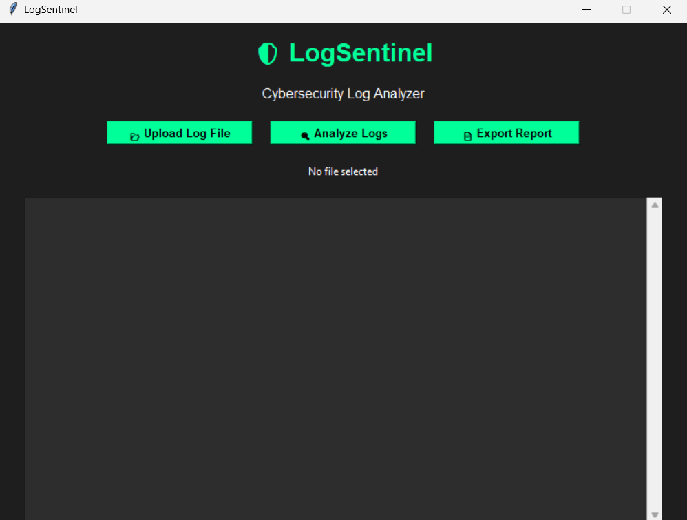
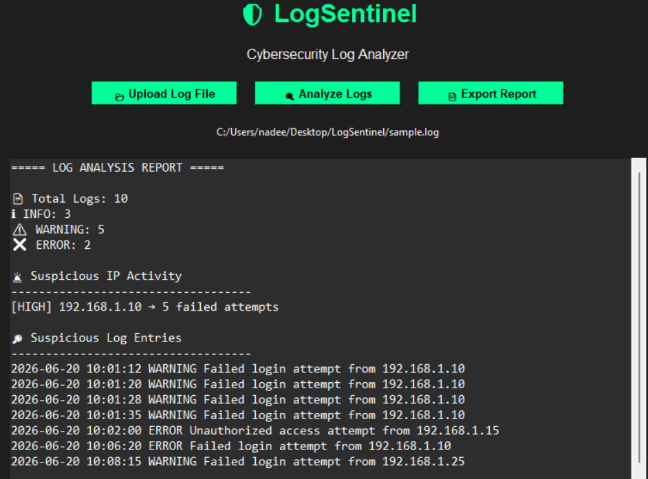
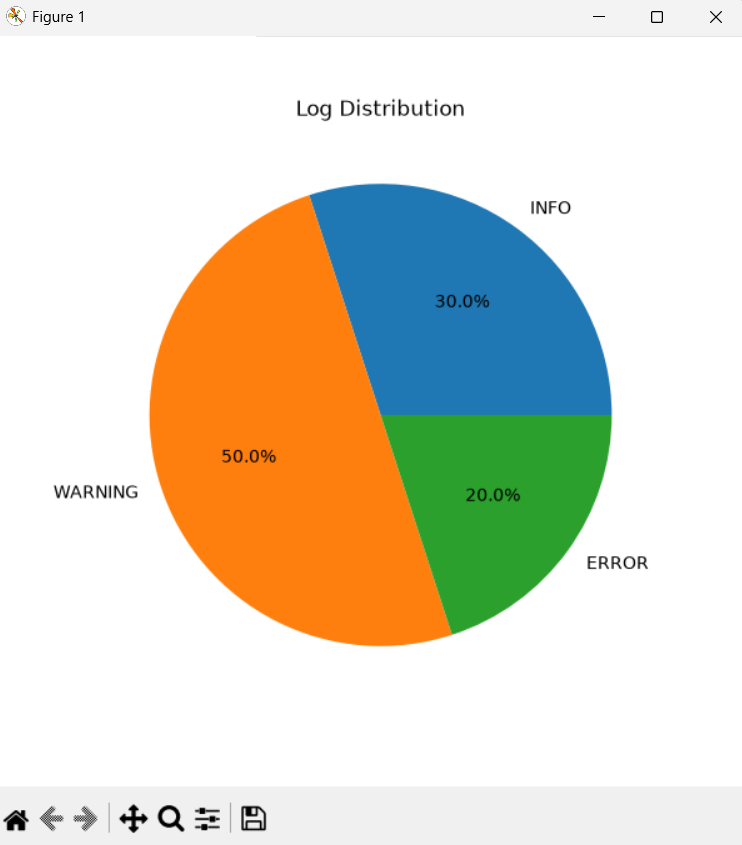
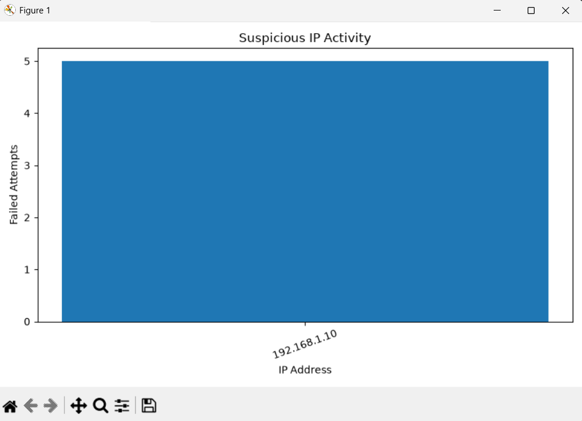
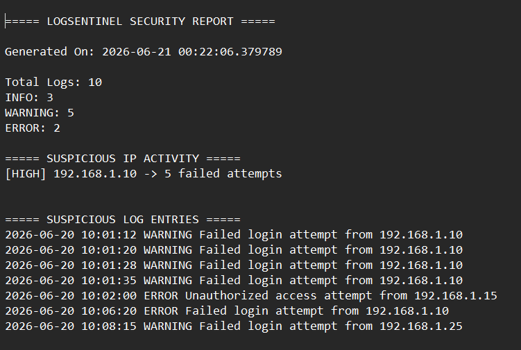

# 🛡️ LogSentinel

A Python-based cybersecurity log analyzer that detects suspicious activities, brute-force attacks, and potential security threats from log files. LogSentinel provides an intuitive graphical interface, visual analytics, and automated report generation to help security analysts quickly identify anomalies.

---

## 🚀 Features

* 📂 Upload and analyze `.log` and `.txt` files
* 📊 Count and categorize INFO, WARNING, and ERROR logs
* 🚨 Detect suspicious IP addresses involved in repeated failed login attempts
* 🔒 Identify possible brute-force attacks
* 🔍 Detect suspicious activities using keyword-based analysis
* 📈 Generate visual charts for log analysis
* 📄 Export detailed security reports automatically
* 🖥️ User-friendly GUI built with Tkinter

---

## 🛠️ Technologies Used

* **Python 3**
* **Tkinter** (GUI)
* **Matplotlib** (Data Visualization)
* **Regular Expressions (re)**
* **Collections Module**
* **File Handling**

---

## 📸 Screenshots

### Main GUI



---

### Analysis Output



---

### Pie Chart Visualization



---

### Bar Chart Visualization



---

### Generated Security Report



---

## 📥 Installation

### Clone the Repository

```bash
git clone https://github.com/Nxdeeem/LogSentinel.git
cd LogSentinel
```

### Create a Virtual Environment (Optional)

```bash
python -m venv venv
```

### Activate the Virtual Environment

**Windows**

```bash
venv\Scripts\activate
```

**Linux/macOS**

```bash
source venv/bin/activate
```

### Install Dependencies

```bash
pip install -r requirements.txt
```

---

## ▶️ Usage

Run the application using:

```bash
python logsentinel.py
```

1. Click **Upload Log File** and select a `.log` or `.txt` file.
2. Click **Analyze Logs** to begin analysis.
3. View suspicious activities and visual charts.
4. Export the results using **Export Report**.

---

## 📝 Sample Log Entries

```text
2026-06-20 10:10:00 INFO User login successful
2026-06-20 10:11:00 WARNING Multiple failed login attempts detected
2026-06-20 10:12:00 ERROR Access denied for user root
2026-06-20 10:13:00 ERROR Failed login attempt from 192.168.1.10
2026-06-20 10:14:00 ERROR SQL Injection attempt from 192.168.1.50
2026-06-20 10:15:00 WARNING Malware signature detected
```

---

## 🎯 Future Improvements

* PDF report generation
* Real-time log monitoring
* Email alert system
* Risk score dashboard
* Machine Learning-based anomaly detection
* Live SIEM integration

---

## 👨‍💻 Author

**Nadeem Najumudeen**

* GitHub: https://github.com/Nxdeeem

---

⭐ If you found this project useful, consider giving it a star!
